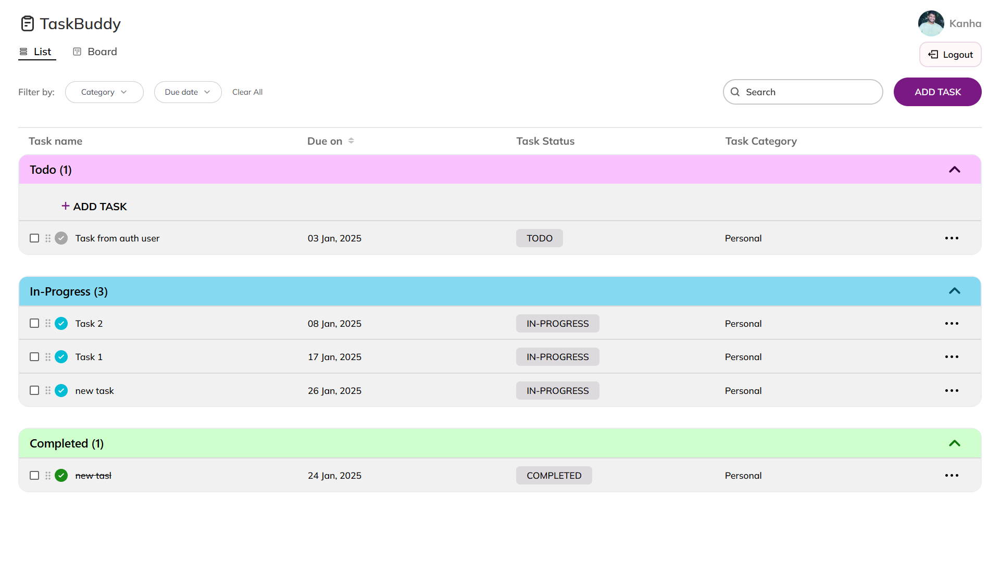
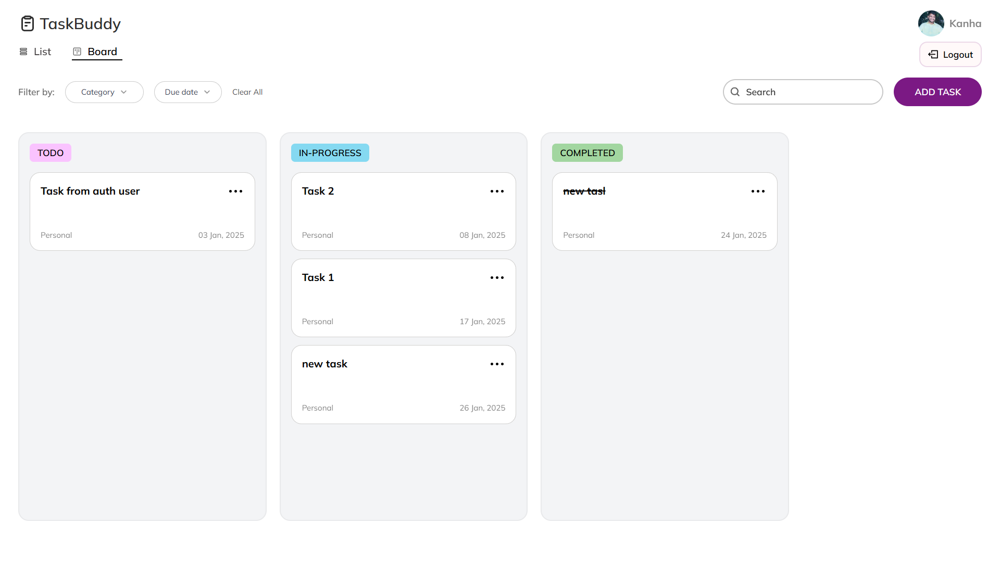

# TaskBuddy - Task Management App

TaskBuddy is a powerful and user-friendly task management application built using React and TypeScript. The app helps users manage tasks efficiently with a variety of features such as Google Firebase authentication, Firestore database integration, and file storage via Supabase buckets. Whether you're working on personal or work-related tasks, TaskBuddy provides all the tools you need to stay organized and productive.

---

## Live Demo

You can try the TaskBuddy app live at the following URL:

[TaskBuddy Live Demo](https://taskbuddy-13.vercel.app/)

---

## Features

- **Task Management**: 
  - Add, update, and delete tasks with detailed information.
  - Set task title, description, category (Work or Personal), due date, and status (Todo, In-Progress, Completed).
  - Store multiple files associated with each task in the Supabase bucket.
  
- **Rich Text Editor**: 
  - Use a rich text editor for writing task descriptions, implemented with the [Draft.js](https://draftjs.org/) library.

- **Custom Date Range Picker**: 
  - A beautiful, intuitive custom date range picker implemented using the [date-fns](https://date-fns.org/) library.

- **File Upload and Preview**: 
  - Drag and drop files into the task with a simple and easy-to-use upload feature.
  - Preview uploaded files before finalizing.

- **Drag-and-Drop Task Tiles**: 
  - Easily move tasks between Todo, In-Progress, and Completed sections using drag-and-drop functionality, implemented using the [`@hello-pangea/dnd`](https://github.com/atlassian/react-beautiful-dnd) library.

- **Task Filters**: 
  - Filter tasks based on category, due date range, task name, and other criteria.
  - Apply and clear filters easily with a clear all filter option.

- **Multi-Task Selection**: 
  - Select multiple tasks and update their status or delete them all at once.

- **Two Different View Modes**: 
  - Choose between List Mode and Kanban Card Mode for different ways to view and manage your tasks.

- **Responsive Design**: 
  - Fully responsive UI that works seamlessly across mobile, tablet, and PC devices.

---

## Tech Stack

- **Frontend**: React, TypeScript, Tailwind CSS, Draft.js (for rich text editor), date-fns (for date picker)
- **Authentication**: Google Firebase Auth
- **Database**: Firestore (for storing tasks)
- **File Storage**: Supabase Bucket (for storing task-related files)
- **Drag and Drop**: [`@hello-pangea/dnd`](https://github.com/atlassian/react-beautiful-dnd) for task tile drag-and-drop functionality
  
---

## Installation

1. Clone the repository:

```bash
git clone https://github.com/Kanha-13/taskbuddy.git
cd taskbuddy
```

2. Install dependencies:

If you're using `yarn`:

```bash
yarn install
```

If you're using `npm`:

```bash
npm install
```

3. Set up Firebase and Supabase:
   - Create a Firebase project and enable authentication.
   - Create a Supabase project and enable the file storage bucket.
   - Add your Firebase and Supabase configuration to the `.env` file.

   A reference `.env.example` file has been provided in the repository to help you set up the necessary environment variables.

4. Start the development server:

If you're using `yarn`:

```bash
yarn start
```

If you're using `npm`:

```bash
npm start
```

Visit `http://localhost:3000` to access the app in your browser.

---

## Screenshots

### Task List View


### Kanban Card View


---

## Contributing

Feel free to fork this repository, submit pull requests, and contribute to this project. Whether you want to improve the UI, add features, or fix bugs, all contributions are welcome!

---

## License

This project is licensed under the MIT License - see the [LICENSE](LICENSE) file for details.

---

## Acknowledgments

- [Draft.js](https://draftjs.org/) for the rich text editor.
- [date-fns](https://date-fns.org/) for the custom date range picker.
- [Supabase](https://supabase.com/) for file storage.
- [Firebase](https://firebase.google.com/) for authentication.
- [`@hello-pangea/dnd`](https://github.com/hello-pangea/dnd) for the drag-and-drop functionality.

---

Enjoy using TaskBuddy for all your task management needs! 🥳

--- 